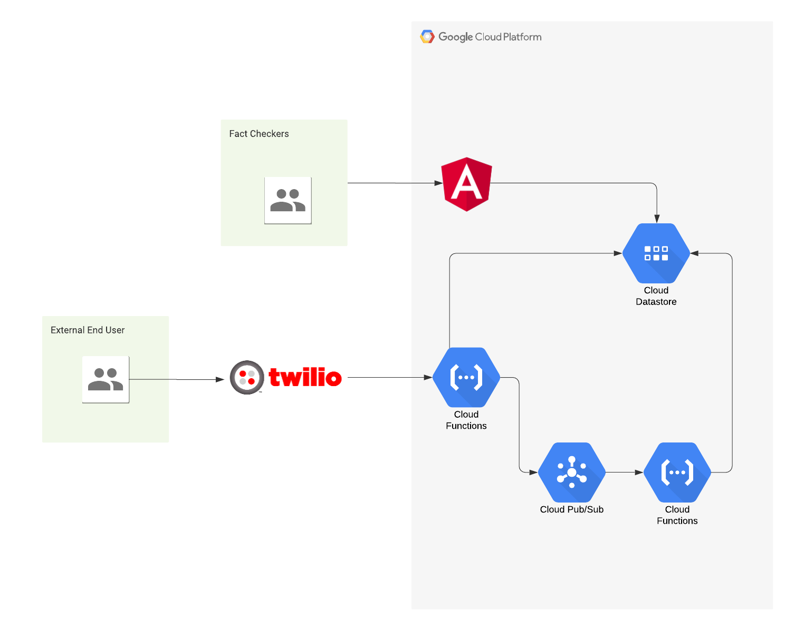

# SMS Fact Checker

## About

This is a tool for fact-checking and tracking messages that are often spread on messaging platforms through forwarding. This can potentially help slow down the spread of dangerous fake news through messaging platforms and aid journalists in tracking the spread of these claims.

Here are some examples of the dangers of fake news on messaging platforms:

- [WhatsApp limits message forwarding to slow spread of coronavirus misinformation - Reuters](https://www.reuters.com/article/us-health-coronavirus-whatsapp/whatsapp-limits-message-forwarding-to-slow-spread-of-coronavirus-misinformation-idUSKBN21P0YZ)
- [How WhatsApp Leads Mobs to Murder in India - NYT](https://www.nytimes.com/interactive/2018/07/18/technology/whatsapp-india-killings.html)

It consists of an SMS responder that logs claims for fact-checking and replies with information on it, and a dashboard for fact checkers to verify received claims and track the spread of messages through time and around the world.

## Features

- SMS Responder

  - Logs claims it receives for fact-checking.
  - Replies with information on claims that it has.

- Dashboard
  - Allows fact checkers to verify received claims.
  - Tracks and displays analytics on claims it receives (number of hits, country of origin etc.).

## Stack

- Angular
- Firebase (Auth, Hosting, Firestore, Functions)
- Google Cloud Platform (PubSub)
- Twilio (Programmable SMS)

### How it works

When the SMS responder receives a new claim, it logs it in Firestore for fact-checking. Next time it receives the same message, it will reply with information on it if it has been fact checked.

Every time the responder receives a claim, a cloud function is triggered with PubSub to log analytics on it which can be tracked in the dashboard to monitor their spread.



## Set up

### Requirements

- [Node.js](https://nodejs.org/)
- A Firebase project with Firestore initialised - [create one](console.firebase.google.com/)
- [Firebase CLI](https://firebase.google.com/docs/cli?hl=vi)
- [Angular CLI](https://cli.angular.io/)
- A Twilio account - [sign up](https://www.twilio.com/try-twilio)

### Local development

After the above requirements have been met:

1. Clone this repository and `cd` into it

```bash
git clone https://github.com/CDDelta/covid-19-fact-checker.git
cd covid-19-fact-checker
```

2. Update your project id in `.firebaserc` and replace the Firebase SDK config in `/src/environments/environment.ts` and `/src/environments/environment.prod.ts`.

3. Install dependencies

```bash
npm install
```

4. Run the application

```bash
npm start
```

5. Navigate to [http://localhost:4200](http://localhost:4200)

6. Enable passwordless sign in in Firebase and add a user to allow sign in to the dashboard.

That's it!

You can addtionally setup the Firebase [emulators](https://firebase.google.com/docs/rules/emulator-setup) to run completely offline.

### Mock Data

You can add mock data into your database with these steps.

1. Download a service account credential from [Firebase](https://console.firebase.google.com) for the Admin SDK.

2. Place the credential in the root directory and rename it `firebase-cert.json`.

3. `cd` into the `functions` directory and run

```bash
node database-seeder.js
```

### Deployment

#### Twilio Account Settings

Before we begin, we need to collect
all the config values we need to run the application:

| Config&nbsp;Value | Description                                                                                          |
| :---------------- | :--------------------------------------------------------------------------------------------------- |
| Account&nbsp;Sid  | Your primary Twilio account identifier - find this [in the Console](https://www.twilio.com/console). |
| Auth&nbsp;Token   | Used to authenticate - [just like the above, you'll find this here](https://www.twilio.com/console). |

1. Set config variables

```bash
firebase functions:config:set twilio.account_sid="ACXXXXXXXXXXXXXXXXXXXXXXXXXXXXXXXX" twilio.auth_token="your_auth_token"
```

2. Deploy the dashboard

```bash
ng deploy
```

3. Deploy the backend

```bash
firebase deploy --only functions,firestore
```

4. Point the twilio Programmable SMS webhook to the `onMessageReceived` Firebase Function.

You can now message your twilio phone number to use the SMS responder or visit the dashboard at your Firebase Hosting domain.

## Screenshots

Claims list                                     |  Claims detail                                   | Claims edit                                  |
:----------------------------------------------:|:------------------------------------------------:|:--------------------------------------------:|
  |  |  |

#### SMS responder


## License

[MIT](http://www.opensource.org/licenses/mit-license.html)

## Disclaimer

No warranty expressed or implied. Software is as is.
